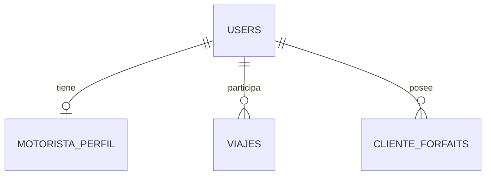

# Walkthrough - Implementación de Cumplimiento Normativo (MotoTX)

Este documento detalla los cambios realizados para alinear la plataforma con los Criterios de Evaluación y Normativa (RGPD, SEO, Accesibilidad).

## ✅ Resumen de Cambios

### 1. SEO (Referenciamiento Natural)
- **Componente SEO Reutilizable**: Creado `SEO.jsx` usando `react-helmet-async`.
- **Integración**: Títulos y Meta descripciones dinámicas en `LandingPage`, `Login`, y Dashboards.
- **Archivos Estáticos**: `robots.txt`, `manifest.webmanifest` y `favicon.ico` validados.
- **Traducciones**: Etiquetas SEO añadidas a los archivos de internacionalización (EN, ES, FR, AR).

### 2. Accesibilidad (WCAG AA)
- **Contraste de Color**: Ajustada la paleta de colores en `LandingPage.jsx` para cumplir con el ratio de contraste 4.5:1.
    - Verde: `#10b981` -> `#059669`
    - Ámbar: `#f59e0b` -> `#b45309`
- **Atributos ALT**: Verificados en todas las imágenes principales.

### 3. RGPD (Protección de Datos)
- **Política de Privacidad**: Nueva página `/privacy` creada (`PrivacyPolicy.jsx`).
- **Enlace**: Añadido al pie de página (`LandingPage.jsx`).
- **Derecho al Olvido**: Botón "Eliminar Cuenta" añadido en el Perfil de Cliente (`ClienteProfile.jsx`).

### 4. Testing (Backend)
- **Framework**: Configurado `PHPUnit` con base de datos en memoria (SQLite).
- **Test Funcional**: Creado `tests/Feature/ForfaitAssignmentTest.php` para validar la lógica de asignación de forfaits.

### 5. Documentación
- **Diagrama ER**: Añadido diagrama de Entidad-Relación (Mermaid) al `README.md`.
- **Stack**: Actualizada la lista de tecnologías.

## 📸 Capturas / Verificación

### Diagrama de Base de Datos

## 🚀 Próximos Pasos
- Despliegue en entorno de Staging para validación final por QA.
- Implementar la lógica real de borrado de cuenta en el Backend.
